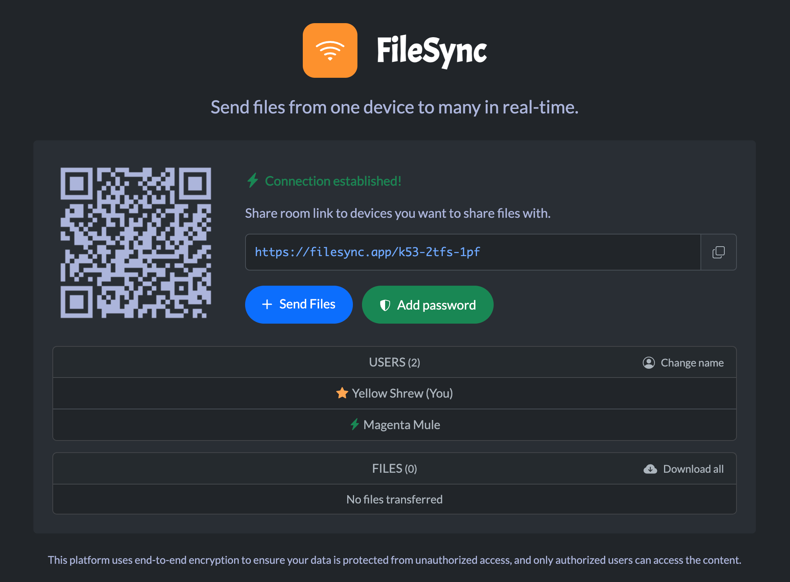
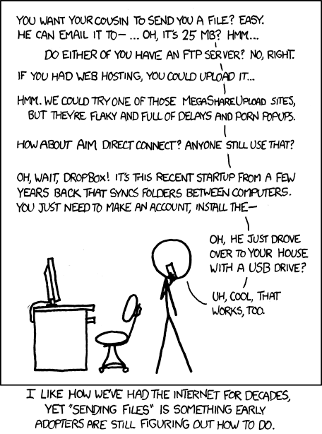

<div align="center">

<h1 align="center">FileSync</h1>

**Send files from one device to many in real-time**

<p align="center">
<a href="https://github.com/polius/filesync/actions/workflows/release.yml"></a>&nbsp;<a href="https://github.com/polius/filesync/releases"></a>&nbsp;<a href="https://hub.docker.com/r/poliuscorp/filesync"></a>
</p>

<br>

<p align="center">
<b>FileSync</b> is a file sharing web application that allows users to transfer files between multiple devices with end-to-end encryption.
</p>

<br>



</div>

## Install

**1. Download required files**

Get the `docker-compose.yml` and `Caddyfile` from the **deploy** folder.

**2. Generate a secure secret key**

Run the following command to generate a 32-byte base64-encoded secret:

```
python3 -c "import secrets, base64; print(base64.b64encode(secrets.token_bytes(32)).decode())"
```

**3. Configure the secret key**

Open `docker-compose.yml` and replace **both occurrences** of `<SECRET_KEY>` with the generated value from the previous step.

**Example:**

```
...
- --static-auth-secret=/RaFOHJQQPAAXRNdaDhfBghvX9+o9UJEazKgIopK3TI=
...
- SECRET_KEY=/RaFOHJQQPAAXRNdaDhfBghvX9+o9UJEazKgIopK3TI=
...
```

**4. (Optional) Enable HTTPS**

To enable HTTPS, edit the `Caddyfile`:

- Replace `localhost:80` with your domain (e.g., `filesync.app`).
- Replace `http://localhost:9000` with your domain and port (e.g., `filesync.app:9000`).

Caddy will automatically provision and renew SSL certificates for your domain.

**Example:**

```
filesync.app {
	reverse_proxy filesync:80
}

filesync.app:9000 {
	reverse_proxy peerjs:9000
}
```

**5. Start the services**

Run the following command to start everything in detached mode:

```
docker-compose up -d
```

**6. Access the application**

Once the services are up;

- For local testing, open your browser at:

```
http://localhost
```

- If using a domain, open:

```
https://yourdomain
```

## Uninstall (Optional)

To stop and remove the containers, run:

```
docker-compose down
```

## Under the hood

FileSync uses [PeerJS](https://github.com/peers/peerjs) (a WebRTC wrapper) to transfer files between multiple devices. Files shared are peer-to-peer, which means there is a direct file transfer between the sender and receiver without any intermediate server. Your files remain private and secure throughout the entire transfer process.

Do note that a [PeerJS server](https://github.com/peers/peerjs-server) is used to assist in the initial connection setup, ensuring all users can establish peer-to-peer connections effectively. Once the connections are established, the server steps back, allowing the direct transfer of files between the sender and the receiver. At no point during this process does the server have access to the file contents. It solely facilitates the connection between users without compromising the privacy or security of the files being shared.

